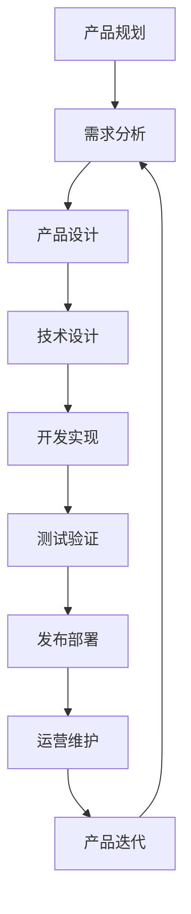
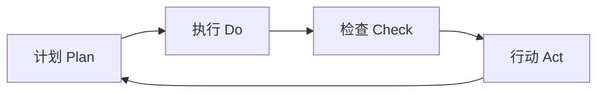
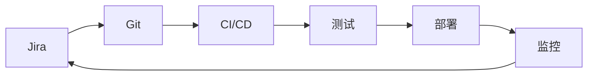

# 产品开发和研发流程规范

## 概述

本文档定义了 SiCal 智能学习平台的产品开发和研发流程规范，旨在建立高效、可控、可持续的产品开发体系，确保产品质量和交付效率。

## 开发理念和原则

### 核心理念
- **用户中心**：以用户价值为导向，持续优化用户体验
- **敏捷迭代**：快速响应变化，持续交付价值
- **质量优先**：内建质量，预防胜于检测
- **团队协作**：跨职能协作，共同承担责任
- **持续改进**：基于数据和反馈持续优化

### 开发原则

#### 1. 精益原则
- **消除浪费**：识别和消除开发过程中的浪费
- **价值流动**：优化价值从概念到交付的流动
- **持续改进**：基于度量和反馈持续优化流程

#### 2. 敏捷原则
- **个体和互动**：重视人员协作胜过流程和工具
- **工作软件**：重视可用软件胜过详尽文档
- **客户合作**：重视客户协作胜过合同谈判
- **响应变化**：重视响应变化胜过遵循计划

#### 3. DevOps原则
- **协作文化**：开发和运维团队紧密协作
- **自动化**：自动化构建、测试、部署流程
- **持续集成**：频繁集成代码，快速发现问题
- **持续交付**：随时可以发布到生产环境

## 产品开发生命周期

### 生命周期概览



### 阶段详述

#### 1. 产品规划阶段 (Product Planning)

##### 目标
- 明确产品愿景和战略目标
- 制定产品路线图和发布计划
- 确定资源分配和时间安排

##### 主要活动

**市场分析**
- 目标用户分析和用户画像
- 竞品分析和市场定位
- 商业模式和盈利模式分析

**产品策略**
- 产品愿景和使命定义
- 核心价值主张确定
- 产品差异化策略制定

**路线图规划**
- 功能优先级排序
- 版本发布计划制定
- 里程碑和关键节点确定

##### 交付物
- 产品愿景文档
- 市场分析报告
- 产品路线图
- 商业计划书

##### 参与角色
- 产品总监
- 产品经理
- 市场分析师
- 业务分析师

#### 2. 需求分析阶段 (Requirements Analysis)

##### 目标
- 深入理解用户需求和业务需求
- 将业务需求转化为产品需求
- 确定功能范围和验收标准

##### 主要活动

**需求收集**
- 用户调研和访谈
- 业务方需求收集
- 数据分析和用户行为分析

**需求分析**
- 需求优先级评估
- 用户故事编写
- 验收标准定义

**需求管理**
- 需求文档编写
- 需求评审和确认
- 需求变更管理

##### 交付物
- 需求规格说明书
- 用户故事集合
- 验收标准文档
- 需求追溯矩阵

##### 参与角色
- 产品经理
- 业务分析师
- 用户体验设计师
- 技术架构师

#### 3. 产品设计阶段 (Product Design)

##### 目标
- 设计用户体验和交互流程
- 定义产品功能和界面规范
- 确保设计的可用性和可实现性

##### 主要活动

**用户体验设计**
- 用户旅程地图设计
- 信息架构设计
- 交互流程设计

**界面设计**
- 线框图和原型设计
- 视觉设计和UI规范
- 设计系统建立

**可用性验证**
- 原型测试和用户验证
- 可用性测试
- 设计迭代优化

##### 交付物
- 用户旅程地图
- 交互原型
- 视觉设计稿
- 设计规范文档

##### 参与角色
- 用户体验设计师
- 视觉设计师
- 产品经理
- 前端开发工程师

#### 4. 技术设计阶段 (Technical Design)

##### 目标
- 设计系统架构和技术方案
- 确定技术选型和实现方案
- 评估技术风险和可行性

##### 主要活动

**架构设计**
- 系统架构设计
- 模块划分和接口定义
- 数据架构设计

**技术选型**
- 技术栈选择和评估
- 第三方服务选型
- 开发工具和框架选择

**详细设计**
- API接口设计
- 数据库设计
- 安全方案设计

##### 交付物
- 系统架构文档
- 技术选型报告
- API设计文档
- 数据库设计文档

##### 参与角色
- 技术架构师
- 后端开发工程师
- 前端开发工程师
- 数据库工程师

#### 5. 开发实现阶段 (Development Implementation)

##### 目标
- 按照设计文档实现产品功能
- 确保代码质量和开发效率
- 及时发现和解决技术问题

##### 主要活动

**迭代开发**
- Sprint规划和任务分解
- 每日站会和进度同步
- Sprint评审和回顾

**代码开发**
- 功能模块开发
- 代码审查和质量检查
- 单元测试编写

**集成联调**
- 模块集成和接口联调
- 系统集成测试
- 问题修复和优化

##### 交付物
- 功能代码
- 单元测试用例
- 集成测试报告
- 技术文档

##### 参与角色
- 开发团队负责人
- 前端开发工程师
- 后端开发工程师
- 测试工程师

#### 6. 测试验证阶段 (Testing & Validation)

##### 目标
- 验证产品功能的正确性和完整性
- 确保产品质量达到发布标准
- 识别和修复产品缺陷

##### 主要活动

**功能测试**
- 系统功能测试
- 集成测试
- 回归测试

**非功能测试**
- 性能测试
- 安全测试
- 兼容性测试

**用户验收测试**
- 业务场景测试
- 用户体验测试
- 验收标准确认

##### 交付物
- 测试计划和用例
- 测试执行报告
- 缺陷报告和修复记录
- 验收测试报告

##### 参与角色
- 测试经理
- 功能测试工程师
- 性能测试工程师
- 产品经理

#### 7. 发布部署阶段 (Release & Deployment)

##### 目标
- 将产品安全稳定地部署到生产环境
- 确保发布过程的可控和可回滚
- 监控发布后的系统状态

##### 主要活动

**发布准备**
- 发布计划制定
- 环境准备和配置
- 发布脚本和流程验证

**灰度发布**
- 小范围用户试用
- 监控系统指标
- 逐步扩大发布范围

**全量发布**
- 全面开放功能
- 实时监控和告警
- 问题快速响应

##### 交付物
- 发布计划
- 部署脚本
- 监控配置
- 发布报告

##### 参与角色
- 运维工程师
- 开发工程师
- 产品经理
- 技术支持

#### 8. 运营维护阶段 (Operations & Maintenance)

##### 目标
- 确保产品稳定运行
- 收集用户反馈和使用数据
- 持续优化产品性能

##### 主要活动

**系统监控**
- 性能指标监控
- 错误日志分析
- 用户行为分析

**用户支持**
- 用户问题处理
- 使用培训和指导
- 反馈收集和分析

**持续优化**
- 性能调优
- 功能优化
- 用户体验改进

##### 交付物
- 运维监控报告
- 用户反馈分析
- 优化建议报告
- 下版本需求输入

##### 参与角色
- 运维工程师
- 产品运营
- 客户支持
- 数据分析师

## 敏捷开发流程

### Scrum框架

#### 角色定义

**Product Owner (产品负责人)**
- 负责产品愿景和路线图
- 管理产品待办列表 (Product Backlog)
- 定义用户故事和验收标准
- 参与Sprint评审和规划

**Scrum Master (敏捷教练)**
- 促进Scrum流程的执行
- 移除团队开发障碍
- 组织Scrum会议
- 指导团队持续改进

**Development Team (开发团队)**
- 跨职能的自组织团队
- 负责Sprint目标的实现
- 估算工作量和承诺交付
- 持续改进开发实践

#### 工件 (Artifacts)

**Product Backlog (产品待办列表)**
- 产品功能需求的优先级列表
- 包含用户故事、缺陷修复、技术任务
- 由Product Owner维护和优先级排序
- 持续细化和更新

**Sprint Backlog (迭代待办列表)**
- 当前Sprint要完成的任务列表
- 从Product Backlog中选择的高优先级项目
- 包含任务分解和工作量估算
- 团队承诺在Sprint内完成

**Increment (产品增量)**
- Sprint结束时交付的可工作产品
- 满足"完成定义"的功能集合
- 可以部署到生产环境
- 累积所有Sprint的成果

#### 事件 (Events)

**Sprint (迭代)**
- 固定时间盒，通常2-4周
- 团队专注于实现Sprint目标
- 不允许改变Sprint范围
- 结束时交付可工作的产品增量

**Sprint Planning (迭代规划)**
- 时间：Sprint时长的8%（如2周Sprint用半天）
- 参与者：整个Scrum团队
- 目标：确定Sprint目标和Sprint Backlog
- 输出：Sprint目标、Sprint Backlog、工作计划

**Daily Scrum (每日站会)**
- 时间：每天15分钟
- 参与者：开发团队
- 目标：同步进度，识别障碍
- 内容：昨天做了什么、今天计划做什么、遇到什么障碍

**Sprint Review (迭代评审)**
- 时间：Sprint时长的4%（如2周Sprint用2小时）
- 参与者：Scrum团队和利益相关者
- 目标：展示Sprint成果，收集反馈
- 输出：产品增量演示、反馈收集、Product Backlog调整

**Sprint Retrospective (迭代回顾)**
- 时间：Sprint时长的3%（如2周Sprint用1.5小时）
- 参与者：Scrum团队
- 目标：反思过程，识别改进机会
- 输出：改进行动计划

### 看板方法 (Kanban)

#### 核心原则
- **可视化工作流**：使用看板展示工作状态
- **限制在制品**：控制每个阶段的工作数量
- **管理流动**：优化工作从开始到完成的流动
- **明确政策**：制定明确的工作流程规则
- **反馈循环**：建立反馈机制持续改进
- **协作改进**：团队共同改进流程

#### 看板设计

```
待办 | 分析中 | 开发中 | 测试中 | 已完成
-----|--------|--------|--------|--------
需求A |  需求B  |  功能C  |  功能D  |  功能E
需求F |        |  功能G  |        |  功能H
需求I |        |        |        |  功能J

WIP限制: 无限 | 2 | 3 | 2 | 无限
```

#### 度量指标
- **前置时间 (Lead Time)**：从需求提出到交付的总时间
- **周期时间 (Cycle Time)**：从开始开发到完成的时间
- **吞吐量 (Throughput)**：单位时间内完成的工作项数量
- **在制品数量 (WIP)**：正在进行中的工作项数量

## 技术开发规范

### 代码开发规范

#### 编码标准

**命名规范**
- 使用有意义的变量和函数名
- 遵循驼峰命名法或下划线命名法
- 避免使用缩写和单字母变量
- 常量使用全大写字母

**代码结构**
- 保持函数简短，单一职责
- 合理使用注释，解释复杂逻辑
- 保持代码缩进和格式一致
- 避免深层嵌套，提高可读性

**错误处理**
- 统一的错误处理机制
- 记录详细的错误日志
- 优雅的错误降级处理
- 用户友好的错误提示

#### 代码审查流程

**审查原则**
- 所有代码必须经过审查才能合并
- 至少需要一个其他开发者的批准
- 关注代码质量、安全性、性能
- 提供建设性的反馈意见

**审查清单**
- [ ] 代码功能是否正确实现
- [ ] 代码是否遵循编码规范
- [ ] 是否有适当的错误处理
- [ ] 是否有必要的单元测试
- [ ] 是否有安全漏洞
- [ ] 性能是否可以接受
- [ ] 代码是否易于理解和维护

### 版本控制规范

#### Git工作流

**分支策略**
```
master/main     ←── 生产环境代码
    ↑
develop        ←── 开发集成分支
    ↑
feature/*      ←── 功能开发分支
hotfix/*       ←── 紧急修复分支
release/*      ←── 发布准备分支
```

**分支命名规范**
- `feature/功能名称`：新功能开发
- `bugfix/问题描述`：bug修复
- `hotfix/紧急修复`：生产环境紧急修复
- `release/版本号`：发布准备

**提交信息规范**
```
<type>(<scope>): <subject>

<body>

<footer>
```

**类型 (type)**
- `feat`：新功能
- `fix`：bug修复
- `docs`：文档更新
- `style`：代码格式调整
- `refactor`：代码重构
- `test`：测试相关
- `chore`：构建过程或辅助工具的变动

**示例**
```
feat(user): add user registration functionality

- Add user registration form
- Implement email validation
- Add password strength check

Closes #123
```

### 持续集成/持续部署 (CI/CD)

#### CI/CD流水线


#### 构建配置

**前端构建**
```yaml
# .github/workflows/frontend.yml
name: Frontend CI/CD

on:
  push:
    branches: [main, develop]
  pull_request:
    branches: [main]

jobs:
  build:
    runs-on: ubuntu-latest
    
    steps:
    - uses: actions/checkout@v2
    
    - name: Setup Node.js
      uses: actions/setup-node@v2
      with:
        node-version: '16'
        
    - name: Install dependencies
      run: npm ci
      
    - name: Run tests
      run: npm test
      
    - name: Build
      run: npm run build
      
    - name: Deploy
      run: npm run deploy
```

**后端构建**
```yaml
# .github/workflows/backend.yml
name: Backend CI/CD

on:
  push:
    branches: [main, develop]

jobs:
  build:
    runs-on: ubuntu-latest
    
    steps:
    - uses: actions/checkout@v2
    
    - name: Setup Node.js
      uses: actions/setup-node@v2
      with:
        node-version: '16'
        
    - name: Install dependencies
      run: npm ci
      
    - name: Run tests
      run: npm test
      
    - name: Build Docker image
      run: docker build -t app:${{ github.sha }} .
      
    - name: Deploy
      run: |
        docker tag app:${{ github.sha }} app:latest
        docker push app:latest
```

#### 质量门禁

**代码质量标准**
- 代码覆盖率 ≥ 80%
- 代码重复率 ≤ 3%
- 代码复杂度 ≤ 10
- 安全漏洞数量 = 0

**自动化检查**
- ESLint/TSLint 代码规范检查
- SonarQube 代码质量分析
- OWASP 安全漏洞扫描
- 依赖包安全检查

### 测试策略

#### 测试金字塔

```
        E2E测试
       (少量，慢)
      /          \
   集成测试
  (适量，中等)
 /              \
单元测试
(大量，快)
```

#### 测试类型

**单元测试**
- 测试单个函数或组件
- 快速执行，频繁运行
- 覆盖率目标：≥ 80%
- 工具：Jest, Mocha, Jasmine

**集成测试**
- 测试模块间的协作
- 验证接口和数据流
- 包含API测试和数据库测试
- 工具：Supertest, Postman

**端到端测试**
- 测试完整的用户场景
- 模拟真实用户操作
- 验证系统整体功能
- 工具：Cypress, Selenium, Playwright

**性能测试**
- 负载测试和压力测试
- 响应时间和吞吐量测试
- 资源使用率监控
- 工具：JMeter, K6, Artillery

#### 测试自动化

**自动化策略**
- 优先自动化回归测试
- 自动化核心业务流程
- 自动化API接口测试
- 自动化性能基准测试

**测试环境管理**
- 开发环境：开发者本地测试
- 测试环境：功能测试和集成测试
- 预生产环境：性能测试和用户验收测试
- 生产环境：监控和告警

## 团队协作规范

### 沟通协作

#### 会议规范

**每日站会 (Daily Standup)**
- 时间：每天上午9:30，15分钟
- 参与者：开发团队全员
- 内容：昨天完成、今天计划、遇到障碍
- 原则：简短高效，问题会后解决

**Sprint规划会 (Sprint Planning)**
- 时间：每个Sprint开始，2-4小时
- 参与者：Scrum团队全员
- 内容：确定Sprint目标和任务
- 输出：Sprint Backlog和承诺

**Sprint评审会 (Sprint Review)**
- 时间：每个Sprint结束，1-2小时
- 参与者：团队和利益相关者
- 内容：演示完成功能，收集反馈
- 输出：产品增量和改进建议

**Sprint回顾会 (Sprint Retrospective)**
- 时间：每个Sprint结束，1小时
- 参与者：Scrum团队
- 内容：回顾过程，识别改进点
- 输出：改进行动计划

#### 文档协作

**文档类型**
- 需求文档：产品需求和用户故事
- 设计文档：架构设计和接口设计
- 开发文档：代码文档和API文档
- 测试文档：测试计划和测试报告
- 运维文档：部署文档和运维手册

**文档规范**
- 使用统一的文档模板
- 保持文档的及时更新
- 版本控制和变更记录
- 易于搜索和访问

### 知识管理

#### 知识分享

**技术分享**
- 每周技术分享会
- 新技术调研和分享
- 项目经验总结
- 最佳实践分享

**代码审查**
- 知识传递和技能提升
- 代码质量保证
- 团队编码规范统一
- 问题早期发现

**结对编程**
- 复杂功能的协作开发
- 新人培训和指导
- 知识快速传递
- 代码质量提升

#### 培训发展

**技能培训**
- 新技术培训
- 工具使用培训
- 最佳实践培训
- 软技能培训

**职业发展**
- 个人发展计划制定
- 技能评估和提升
- 内部轮岗和学习
- 外部培训和认证

## 质量管理

### 质量标准

#### 功能质量
- 功能完整性：100%实现需求规格
- 功能正确性：通过所有测试用例
- 易用性：用户满意度 ≥ 4.0/5.0
- 可访问性：符合WCAG 2.1 AA标准

#### 技术质量
- 代码质量：SonarQube评分 ≥ A级
- 测试覆盖率：≥ 80%
- 性能指标：响应时间 ≤ 2秒
- 安全性：无高危安全漏洞

#### 过程质量
- 交付及时率：≥ 90%
- 缺陷逃逸率：≤ 5%
- 客户满意度：≥ 4.5/5.0
- 团队满意度：≥ 4.0/5.0

### 质量保证活动

#### 预防活动
- 需求评审和澄清
- 设计评审和验证
- 代码审查和静态分析
- 测试用例设计和评审

#### 检测活动
- 单元测试和集成测试
- 系统测试和验收测试
- 性能测试和安全测试
- 用户体验测试

#### 改进活动
- 缺陷根因分析
- 过程改进和优化
- 最佳实践总结
- 团队能力提升

## 风险管理

### 风险识别

#### 技术风险
- 技术选型风险
- 架构设计风险
- 第三方依赖风险
- 性能和扩展性风险

#### 项目风险
- 需求变更风险
- 资源不足风险
- 进度延期风险
- 质量不达标风险

#### 业务风险
- 市场变化风险
- 竞争对手风险
- 用户接受度风险
- 商业模式风险

### 风险应对

#### 风险预防
- 技术预研和验证
- 原型开发和测试
- 备选方案准备
- 团队技能培训

#### 风险监控
- 定期风险评估
- 关键指标监控
- 早期预警机制
- 风险状态报告

#### 风险应对
- 风险规避策略
- 风险缓解措施
- 风险转移方案
- 应急响应计划

## 度量和改进

### 关键指标

#### 交付指标
- **交付速度**：每Sprint交付的故事点数
- **交付质量**：缺陷密度和逃逸率
- **交付及时率**：按时完成的Sprint比例
- **客户满意度**：用户对交付功能的满意度

#### 过程指标
- **开发效率**：代码提交频率和代码行数
- **测试效率**：测试用例执行效率和自动化率
- **部署频率**：生产环境部署的频率
- **故障恢复时间**：从故障发生到恢复的时间

#### 质量指标
- **代码质量**：代码复杂度、重复率、覆盖率
- **产品质量**：缺陷数量、性能指标、用户体验
- **过程质量**：流程遵循度、文档完整性

### 持续改进

#### 改进循环



#### 改进方法

**数据驱动改进**
- 收集和分析度量数据
- 识别改进机会和瓶颈
- 制定改进目标和计划
- 实施改进措施并验证效果

**团队反思改进**
- Sprint回顾会议
- 问题根因分析
- 最佳实践总结
- 改进行动计划

**基准对比改进**
- 行业最佳实践对比
- 竞争对手分析
- 内部团队对比
- 历史数据对比

## 工具和平台

### 开发工具链

#### 项目管理工具
- **Jira**：需求管理、任务跟踪、缺陷管理
- **Confluence**：文档协作、知识管理
- **Slack/Teams**：即时通讯、团队协作
- **Zoom/腾讯会议**：视频会议、远程协作

#### 开发工具
- **IDE**：VS Code, IntelliJ IDEA, WebStorm
- **版本控制**：Git, GitHub/GitLab
- **API工具**：Postman, Insomnia
- **数据库工具**：Navicat, DBeaver

#### 测试工具
- **单元测试**：Jest, Mocha, JUnit
- **集成测试**：Supertest, TestContainers
- **E2E测试**：Cypress, Selenium, Playwright
- **性能测试**：JMeter, K6, Artillery

#### 运维工具
- **容器化**：Docker, Kubernetes
- **CI/CD**：GitHub Actions, Jenkins, GitLab CI
- **监控**：Prometheus, Grafana, ELK Stack
- **云平台**：AWS, Azure, 阿里云

### 工具集成

#### 开发流程集成


#### 数据流转
- Jira任务 → Git分支 → 代码提交
- 代码提交 → CI构建 → 自动测试
- 测试通过 → 自动部署 → 监控告警
- 监控数据 → 分析报告 → 改进建议

## 最佳实践

### 开发最佳实践

#### 代码质量
1. **编写清晰的代码**：代码即文档，优先可读性
2. **单一职责原则**：每个函数只做一件事
3. **DRY原则**：不要重复自己，复用代码
4. **YAGNI原则**：你不会需要它，避免过度设计
5. **持续重构**：保持代码整洁，及时重构

#### 测试实践
1. **测试驱动开发**：先写测试，再写代码
2. **测试金字塔**：大量单元测试，适量集成测试，少量E2E测试
3. **测试自动化**：自动化回归测试和核心流程测试
4. **测试数据管理**：使用测试数据工厂，保证测试独立性

#### 部署实践
1. **基础设施即代码**：使用代码管理基础设施配置
2. **蓝绿部署**：零停机时间部署
3. **金丝雀发布**：逐步发布，降低风险
4. **回滚策略**：快速回滚机制，确保系统稳定

### 团队协作最佳实践

#### 沟通协作
1. **透明沟通**：信息公开透明，避免信息孤岛
2. **及时反馈**：快速反馈，快速调整
3. **主动协作**：主动寻求帮助，主动提供帮助
4. **知识分享**：定期分享，共同成长

#### 项目管理
1. **小步快跑**：小批量，快速迭代
2. **拥抱变化**：适应变化，灵活调整
3. **持续改进**：定期回顾，持续优化
4. **客户导向**：以客户价值为中心

## 总结

产品开发和研发流程规范是确保项目成功的重要基础。通过建立完善的流程规范，我们能够：

1. **提高开发效率**：标准化流程减少重复工作和沟通成本
2. **保证产品质量**：多层次质量保证体系确保交付质量
3. **降低项目风险**：规范的风险管理流程预防和应对风险
4. **促进团队协作**：清晰的角色分工和协作机制提高团队效率
5. **支持持续改进**：度量和反馈机制支持流程持续优化

这个流程规范将随着团队的成长和项目的发展不断完善和优化，确保始终适应项目的实际需要。

---

**相关文档**：
- [项目管理框架](./project-management-framework.md)
- [需求管理流程](./requirements-management.md)
- [测试管理体系](./testing-management-system.md)
- [版本发布流程](./release-management-process.md)