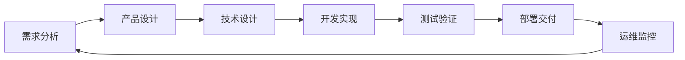

# SiCal 项目管理框架

## 概述

本文档定义了 SiCal 智能学习平台的完整项目管理框架，涵盖从需求收集到产品交付的全生命周期管理流程。

## 项目管理原则

### 核心原则
- **敏捷开发**：采用敏捷开发方法论，快速迭代，持续交付
- **质量优先**：在每个阶段都确保质量标准，预防缺陷而非修复缺陷
- **透明协作**：所有流程透明化，促进团队协作和沟通
- **持续改进**：定期回顾和优化流程，提升团队效率
- **风险管控**：主动识别和管理项目风险

### 管理目标
- 确保项目按时、按质、按预算交付
- 提高团队协作效率和产品质量
- 建立可重复、可扩展的开发流程
- 实现需求的可追溯性和变更管控

## 项目组织架构

### 角色定义

#### 项目管理层
- **项目经理 (PM)**：负责项目整体规划、进度管控和资源协调
- **产品经理 (PO)**：负责产品需求定义、优先级排序和验收标准
- **技术负责人 (TL)**：负责技术架构设计和开发团队管理

#### 开发团队
- **前端开发工程师**：负责用户界面和交互开发
- **后端开发工程师**：负责服务端逻辑和API开发
- **全栈开发工程师**：负责前后端协调开发
- **DevOps工程师**：负责部署、运维和CI/CD流程

#### 质量保证团队
- **测试工程师**：负责功能测试、性能测试和自动化测试
- **QA工程师**：负责质量流程监控和改进

#### 支持团队
- **UI/UX设计师**：负责用户体验设计和界面设计
- **数据分析师**：负责数据需求分析和效果评估

### 沟通机制

#### 定期会议
- **每日站会**：15分钟，同步进度和问题
- **周例会**：1小时，回顾周进展和计划下周工作
- **月度回顾**：2小时，总结月度成果和改进点
- **季度规划**：半天，制定季度目标和里程碑

#### 沟通工具
- **即时沟通**：Slack/钉钉/企业微信
- **项目管理**：Jira/Trello/Notion
- **文档协作**：Confluence/语雀/飞书文档
- **代码协作**：GitHub/GitLab

## 项目生命周期

### 阶段划分



### 1. 需求分析阶段

#### 目标
- 明确业务需求和用户需求
- 定义功能范围和验收标准
- 评估技术可行性和资源需求

#### 交付物
- 需求规格说明书 (PRD)
- 用户故事和验收标准
- 技术可行性分析报告
- 项目计划和里程碑

#### 关键活动
- 需求调研和用户访谈
- 竞品分析和市场调研
- 需求优先级排序
- 风险识别和评估

### 2. 产品设计阶段

#### 目标
- 设计用户体验和交互流程
- 定义产品功能和界面规范
- 制定产品原型和设计规范

#### 交付物
- 产品原型 (Prototype)
- UI/UX设计稿
- 交互设计规范
- 设计系统文档

#### 关键活动
- 用户体验设计
- 界面设计和原型制作
- 设计评审和优化
- 设计规范制定

### 3. 技术设计阶段

#### 目标
- 设计系统架构和技术方案
- 定义API接口和数据模型
- 制定开发规范和标准

#### 交付物
- 系统架构设计文档
- API接口设计文档
- 数据库设计文档
- 开发规范和编码标准

#### 关键活动
- 技术选型和架构设计
- 接口设计和数据建模
- 技术方案评审
- 开发环境搭建

### 4. 开发实现阶段

#### 目标
- 按照设计文档实现功能
- 确保代码质量和规范性
- 完成单元测试和集成测试

#### 交付物
- 功能代码和文档
- 单元测试用例
- 集成测试报告
- 代码审查记录

#### 关键活动
- 功能开发和代码实现
- 代码审查和质量检查
- 单元测试和集成测试
- 持续集成和部署

### 5. 测试验证阶段

#### 目标
- 验证功能的正确性和完整性
- 确保产品质量和性能指标
- 完成用户验收测试

#### 交付物
- 测试计划和测试用例
- 测试执行报告
- 缺陷报告和修复记录
- 用户验收测试报告

#### 关键活动
- 功能测试和性能测试
- 安全测试和兼容性测试
- 用户验收测试
- 缺陷修复和回归测试

### 6. 部署交付阶段

#### 目标
- 将产品部署到生产环境
- 确保系统稳定运行
- 完成用户培训和文档交付

#### 交付物
- 部署方案和操作手册
- 用户使用手册
- 运维监控方案
- 项目交付报告

#### 关键活动
- 生产环境部署
- 系统监控和告警配置
- 用户培训和支持
- 项目验收和总结

### 7. 运维监控阶段

#### 目标
- 确保系统稳定运行
- 收集用户反馈和使用数据
- 持续优化和改进

#### 交付物
- 运维监控报告
- 用户反馈分析
- 性能优化方案
- 下一版本需求

#### 关键活动
- 系统监控和维护
- 用户反馈收集
- 数据分析和洞察
- 持续改进规划

## 版本管理策略

### 版本命名规范

采用语义化版本控制 (Semantic Versioning)：
- **主版本号 (Major)**：不兼容的API修改
- **次版本号 (Minor)**：向下兼容的功能性新增
- **修订号 (Patch)**：向下兼容的问题修正

格式：`主版本号.次版本号.修订号` (例如：1.2.3)

### 分支管理策略

采用 Git Flow 工作流：

```
master/main     ←── 生产环境代码
    ↑
develop         ←── 开发环境代码
    ↑
feature/*       ←── 功能开发分支
release/*       ←── 版本发布分支
hotfix/*        ←── 紧急修复分支
```

#### 分支说明
- **master/main**：稳定的生产代码，只接受来自 release 和 hotfix 的合并
- **develop**：开发主分支，包含最新的开发功能
- **feature/**：功能开发分支，从 develop 分出，完成后合并回 develop
- **release/**：版本发布分支，从 develop 分出，用于发布准备
- **hotfix/**：紧急修复分支，从 master 分出，修复后合并到 master 和 develop

### 发布流程

#### 1. 版本规划
- 确定版本目标和功能范围
- 制定发布时间表
- 分配开发资源

#### 2. 开发阶段
- 创建 feature 分支进行功能开发
- 完成功能后合并到 develop 分支
- 进行集成测试

#### 3. 发布准备
- 从 develop 创建 release 分支
- 进行发布前测试和bug修复
- 更新版本号和发布说明

#### 4. 正式发布
- 将 release 分支合并到 master
- 创建版本标签 (tag)
- 部署到生产环境

#### 5. 发布后维护
- 监控系统运行状态
- 收集用户反馈
- 必要时创建 hotfix 分支进行紧急修复

## 质量管理体系

### 质量标准

#### 代码质量
- **代码覆盖率**：单元测试覆盖率 ≥ 80%
- **代码复杂度**：圈复杂度 ≤ 10
- **代码规范**：通过 ESLint/TSLint 检查
- **安全扫描**：通过安全漏洞扫描

#### 功能质量
- **功能完整性**：100% 实现需求规格
- **用户体验**：通过可用性测试
- **性能指标**：响应时间 ≤ 2秒
- **兼容性**：支持主流浏览器和设备

#### 交付质量
- **文档完整性**：技术文档和用户文档齐全
- **部署成功率**：≥ 99%
- **回滚时间**：≤ 5分钟
- **故障恢复时间**：≤ 30分钟

### 质量保证流程

#### 1. 开发阶段质量控制
- 代码审查 (Code Review)
- 单元测试和集成测试
- 静态代码分析
- 安全扫描

#### 2. 测试阶段质量验证
- 功能测试和回归测试
- 性能测试和压力测试
- 安全测试和兼容性测试
- 用户验收测试

#### 3. 发布阶段质量确认
- 发布前检查清单
- 灰度发布和监控
- 回滚方案准备
- 发布后验证

## 风险管理

### 风险识别

#### 技术风险
- 技术选型不当
- 架构设计缺陷
- 第三方依赖风险
- 性能和安全问题

#### 项目风险
- 需求变更频繁
- 资源不足或流失
- 进度延期
- 质量不达标

#### 业务风险
- 市场需求变化
- 竞争对手威胁
- 法规政策变化
- 用户接受度低

### 风险应对策略

#### 1. 风险预防
- 充分的需求调研和技术调研
- 制定详细的项目计划和里程碑
- 建立完善的质量保证体系
- 定期进行风险评估和回顾

#### 2. 风险监控
- 建立风险监控指标
- 定期风险状态报告
- 及时预警和响应
- 风险处理跟踪

#### 3. 风险应急
- 制定应急预案
- 建立快速响应机制
- 准备备选方案
- 及时沟通和协调

## 工具和平台

### 项目管理工具
- **Jira**：需求管理、任务跟踪、缺陷管理
- **Confluence**：文档协作和知识管理
- **Slack**：团队沟通和协作
- **Figma**：设计协作和原型制作

### 开发工具
- **Git**：版本控制
- **GitHub/GitLab**：代码托管和协作
- **VS Code**：集成开发环境
- **Docker**：容器化部署

### 测试工具
- **Jest**：单元测试框架
- **Cypress**：端到端测试
- **Postman**：API测试
- **JMeter**：性能测试

### 运维工具
- **Jenkins**：持续集成和部署
- **Prometheus**：系统监控
- **ELK Stack**：日志分析
- **Kubernetes**：容器编排

## 度量和改进

### 关键指标 (KPI)

#### 项目指标
- **按时交付率**：项目按计划完成的比例
- **质量指标**：缺陷密度、客户满意度
- **效率指标**：开发速度、代码复用率
- **成本指标**：预算执行率、资源利用率

#### 团队指标
- **团队满意度**：团队成员工作满意度
- **技能提升**：团队技能发展情况
- **协作效率**：团队协作和沟通效果
- **创新能力**：技术创新和改进建议

### 持续改进

#### 1. 定期回顾
- **Sprint回顾**：每个迭代结束后的回顾
- **项目复盘**：项目完成后的全面总结
- **季度评估**：季度目标达成情况评估
- **年度审计**：年度流程和效果审计

#### 2. 改进实施
- 识别改进机会和优先级
- 制定改进计划和时间表
- 实施改进措施
- 跟踪改进效果

#### 3. 知识管理
- 建立最佳实践库
- 分享经验和教训
- 培训和技能提升
- 文档更新和维护

## 总结

本项目管理框架为 SiCal 智能学习平台提供了完整的项目管理指导，涵盖了从需求到交付的全生命周期管理。通过遵循这个框架，我们能够：

1. **提高项目成功率**：通过规范的流程和质量控制
2. **提升团队效率**：通过明确的角色分工和协作机制
3. **确保产品质量**：通过完善的质量保证体系
4. **降低项目风险**：通过主动的风险管理
5. **促进持续改进**：通过度量和反馈机制

这个框架将随着项目的进展和团队的成长不断完善和优化，确保始终适应项目的实际需要。

---

**下一步行动**：
1. 团队培训和框架推广
2. 工具配置和环境搭建
3. 试点项目实施和验证
4. 根据反馈优化和完善框架