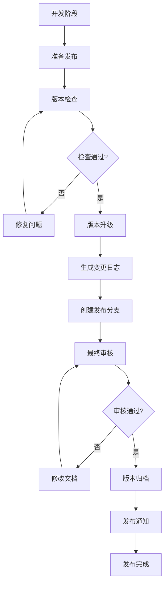

# 版本发布流程文档

## 概述

本文档定义了 SiCal 智能学习平台文档的版本发布流程，确保文档版本的规范化管理和高质量发布。

## 发布流程概览



## 详细发布步骤

### 1. 准备发布 (Pre-Release)

#### 1.1 确定发布版本类型

根据变更内容确定版本升级类型：

- **Major (主版本)**：架构重大变更、破坏性更新
- **Minor (次版本)**：新功能添加、功能增强
- **Patch (修订版)**：错误修复、文档优化

#### 1.2 收集变更信息

```bash
# 查看当前版本状态
node docs/scripts/version-manager.js status

# 收集自上次发布以来的所有变更
git log --oneline --since="2024-01-01" -- docs/
```

#### 1.3 准备变更说明

整理本次发布的主要变更：
- 新增功能
- 功能改进
- 问题修复
- 文档优化

### 2. 版本检查 (Quality Gate)

#### 2.1 文档完整性检查

- [ ] 所有文档都有版本信息头部
- [ ] 版本号格式正确
- [ ] 变更日志完整
- [ ] 文档状态正确

#### 2.2 内容质量检查

- [ ] 文档结构完整
- [ ] 内容逻辑清晰
- [ ] 代码示例正确
- [ ] 链接引用有效
- [ ] 格式规范统一

#### 2.3 技术验证

- [ ] API 文档与实际接口一致
- [ ] 数据库设计与模型匹配
- [ ] 架构图与实现对应

### 3. 版本升级 (Version Bump)

#### 3.1 使用版本管理工具

```bash
# 升级 patch 版本
node docs/scripts/version-manager.js bump patch "修复文档错误,优化格式"

# 升级 minor 版本
node docs/scripts/version-manager.js bump minor "添加新功能设计,增强API文档"

# 升级 major 版本
node docs/scripts/version-manager.js bump major "架构重构,API重大变更"
```

#### 3.2 手动版本更新（如需要）

如果需要手动调整特定文档的版本：

1. 编辑文档的 YAML 前置信息
2. 更新 `version` 字段
3. 更新 `last_updated` 字段
4. 在 `changelog` 中添加变更记录

### 4. 生成变更日志 (Changelog)

```bash
# 自动生成全局变更日志
node docs/scripts/version-manager.js changelog
```

变更日志将包含：
- 版本号和发布日期
- 按模块分类的变更内容
- 影响范围说明

### 5. 创建发布分支 (Release Branch)

```bash
# 创建发布分支
git checkout -b release/v1.2.0

# 提交版本更新
git add docs/
git commit -m "docs: bump version to 1.2.0"

# 推送发布分支
git push origin release/v1.2.0
```

### 6. 最终审核 (Final Review)

#### 6.1 审核团队

根据变更类型确定审核团队：

| 变更类型 | 审核人员 | 审核时间 |
|---------|---------|----------|
| Major | 架构师 + 产品经理 + 技术负责人 | 3-5工作日 |
| Minor | 技术负责人 + 模块负责人 | 1-2工作日 |
| Patch | 同行评审 | 1工作日 |

#### 6.2 审核检查清单

**内容审核**：
- [ ] 技术准确性
- [ ] 逻辑完整性
- [ ] 表达清晰度
- [ ] 示例正确性

**格式审核**：
- [ ] 版本信息完整
- [ ] 格式规范统一
- [ ] 链接引用有效
- [ ] 图表清晰可读

**一致性审核**：
- [ ] 术语使用一致
- [ ] 风格保持统一
- [ ] 版本号正确
- [ ] 变更记录准确

### 7. 版本归档 (Archive)

```bash
# 归档当前版本
node docs/scripts/version-manager.js archive 1.2.0
```

归档操作将：
- 在 `docs/versions/` 目录创建版本快照
- 保存完整的文档结构
- 备份版本配置文件

### 8. 发布合并 (Release Merge)

```bash
# 切换到主分支
git checkout main

# 合并发布分支
git merge release/v1.2.0

# 创建版本标签
git tag -a v1.2.0 -m "Release version 1.2.0"

# 推送到远程仓库
git push origin main
git push origin v1.2.0

# 删除发布分支
git branch -d release/v1.2.0
git push origin --delete release/v1.2.0
```

### 9. 发布通知 (Release Notification)

#### 9.1 内部通知

发送邮件给相关团队：

```
主题：📚 SiCal 文档 v1.2.0 发布通知

团队好，

SiCal 智能学习平台文档 v1.2.0 已正式发布！

🎉 主要更新：
- [功能] 新增学习路径个性化推荐设计
- [API] 完善评估系统接口文档
- [修复] 修正数据库索引设计错误

📖 文档地址：[链接]
📋 完整变更日志：docs/CHANGELOG.md

如有疑问，请联系文档维护团队。

开发团队
```

#### 9.2 更新文档网站

如果有文档网站，更新：
- 最新版本文档
- 版本选择器
- 变更日志页面

## 发布后操作

### 1. 监控反馈

- 收集用户反馈
- 监控文档使用情况
- 记录发现的问题

### 2. 问题处理

如发现问题：
1. 评估问题严重程度
2. 决定是否需要热修复
3. 如需热修复，创建 hotfix 分支
4. 修复后发布 patch 版本

### 3. 经验总结

- 记录发布过程中的问题
- 优化发布流程
- 更新发布检查清单

## 紧急发布流程 (Hotfix)

### 适用场景

- 严重错误需要立即修复
- 安全问题需要紧急处理
- 关键信息错误影响使用

### 简化流程

```bash
# 1. 创建热修复分支
git checkout -b hotfix/v1.2.1 v1.2.0

# 2. 修复问题
# 编辑相关文档...

# 3. 快速版本升级
node docs/scripts/version-manager.js bump patch "紧急修复：修正API文档错误"

# 4. 提交和合并
git add .
git commit -m "hotfix: 修正API文档错误"
git checkout main
git merge hotfix/v1.2.1
git tag v1.2.1
git push origin main v1.2.1

# 5. 发布通知
# 发送紧急修复通知...
```

## 版本管理最佳实践

### 1. 版本规划

- **定期发布**：建议每月发布一次 minor 版本
- **及时修复**：发现问题后 1-2 天内发布 patch 版本
- **重大更新**：每季度评估是否需要 major 版本

### 2. 变更管理

- **小步快跑**：频繁的小更新优于大版本跳跃
- **向后兼容**：尽量保持 API 和格式的向后兼容
- **清晰记录**：详细记录每次变更的原因和影响

### 3. 质量保证

- **自动化检查**：使用脚本自动检查文档格式和完整性
- **同行评审**：重要变更必须经过同行评审
- **用户测试**：重大更新前进行用户可用性测试

### 4. 协作效率

- **明确责任**：每个文档模块指定明确的维护人员
- **及时沟通**：变更前与相关团队充分沟通
- **知识共享**：定期分享文档维护经验和技巧

## 工具和资源

### 版本管理工具

- `docs/scripts/version-manager.js` - 版本管理脚本
- `docs/.version-config.json` - 版本配置文件
- `docs/CHANGELOG.md` - 全局变更日志

### 文档模板

- `docs/templates/` - 各类文档模板
- 包含标准的版本信息头部
- 预定义的文档结构

### 检查清单

- 发布前检查清单
- 审核检查清单
- 质量保证清单

---

**维护说明**：本流程文档应根据实际使用情况定期更新，确保与团队实践保持一致。