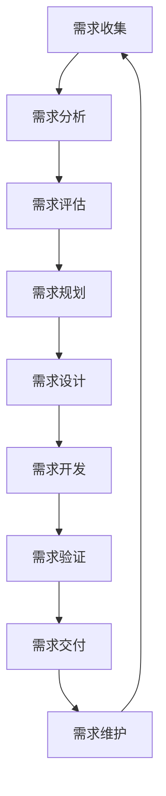
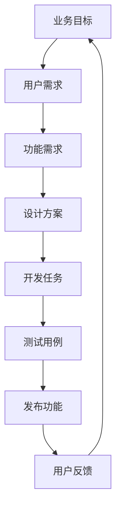

# 需求管理流程

## 概述

需求管理是项目成功的关键因素，本文档定义了 SiCal 智能学习平台的需求管理流程，确保需求的完整性、准确性和可追溯性。

## 需求管理原则

### 核心原则
- **用户导向**：以用户价值为中心，关注用户真实需求
- **数据驱动**：基于数据分析和用户反馈进行决策
- **迭代优化**：持续收集反馈，迭代优化需求
- **可追溯性**：建立需求的全生命周期追溯
- **变更管控**：规范需求变更流程，控制变更影响

### 管理目标
- 确保需求的完整性和准确性
- 提高需求实现的效率和质量
- 建立需求与开发的有效衔接
- 实现需求的全生命周期管理

## 需求分类体系

### 按来源分类
- **业务需求**：来自业务部门的功能需求
- **用户需求**：来自最终用户的使用需求
- **技术需求**：来自技术团队的技术改进需求
- **合规需求**：来自法规政策的合规要求

### 按类型分类
- **功能需求**：系统应该具备的功能特性
- **非功能需求**：性能、安全、可用性等质量属性
- **约束需求**：技术、时间、资源等约束条件
- **接口需求**：与外部系统的集成接口

### 按优先级分类
- **P0 - 必须有 (Must Have)**：核心功能，必须实现
- **P1 - 应该有 (Should Have)**：重要功能，优先实现
- **P2 - 可以有 (Could Have)**：有用功能，资源允许时实现
- **P3 - 暂不要 (Won't Have)**：暂时不实现的功能

## 需求管理流程

### 流程概览



### 1. 需求收集阶段

#### 目标
- 全面收集各方需求
- 识别潜在的用户需求
- 建立需求信息库

#### 收集渠道
- **用户调研**：问卷调查、用户访谈、焦点小组
- **数据分析**：用户行为分析、业务数据分析
- **竞品分析**：竞争对手功能分析、市场趋势分析
- **内部反馈**：销售反馈、客服反馈、运营反馈
- **技术驱动**：新技术应用、性能优化需求

#### 收集方法

##### 用户访谈
- **准备阶段**：制定访谈大纲，选择目标用户
- **执行阶段**：深度访谈，记录用户痛点和期望
- **分析阶段**：整理访谈记录，提取关键需求

##### 问卷调查
- **设计问卷**：明确调研目标，设计有效问题
- **发放回收**：选择合适渠道，确保样本代表性
- **数据分析**：统计分析，识别需求趋势

##### 数据挖掘
- **行为分析**：分析用户使用路径和行为模式
- **漏斗分析**：识别用户流失点和优化机会
- **A/B测试**：验证功能假设和用户偏好

#### 交付物
- 需求收集报告
- 用户画像和用户故事
- 竞品分析报告
- 需求池 (Backlog)

### 2. 需求分析阶段

#### 目标
- 深入理解需求本质
- 识别需求之间的关系
- 明确需求的业务价值

#### 分析维度

##### 业务价值分析
- **用户价值**：解决用户什么问题，带来什么价值
- **商业价值**：对业务指标的影响，ROI评估
- **战略价值**：与公司战略目标的契合度

##### 技术可行性分析
- **技术难度**：实现复杂度和技术风险评估
- **资源需求**：开发时间和人力资源估算
- **技术债务**：对现有系统的影响和改造成本

##### 依赖关系分析
- **前置依赖**：需要先完成的其他需求或条件
- **后续影响**：对其他需求或系统的影响
- **外部依赖**：对第三方系统或服务的依赖

#### 分析方法

##### 用户故事映射
```
用户角色: 作为一个 [用户角色]
用户目标: 我想要 [功能描述]
用户价值: 以便于 [价值描述]

验收标准:
- 给定 [前置条件]
- 当 [操作行为]
- 那么 [预期结果]
```

##### 业务流程分析
- 绘制现有业务流程
- 识别流程痛点和改进机会
- 设计优化后的业务流程

##### 数据流分析
- 识别数据输入和输出
- 分析数据处理逻辑
- 设计数据流转方案

#### 交付物
- 需求分析报告
- 用户故事和验收标准
- 业务流程图
- 数据流图

### 3. 需求评估阶段

#### 目标
- 评估需求的优先级
- 确定需求的实现策略
- 制定需求实现计划

#### 评估维度

##### 价值评估
- **用户影响面**：影响的用户数量和重要程度
- **业务收益**：对关键业务指标的提升
- **战略契合度**：与产品战略的匹配程度

##### 成本评估
- **开发成本**：开发时间和人力投入
- **维护成本**：后续维护和支持成本
- **机会成本**：不做其他需求的损失

##### 风险评估
- **技术风险**：技术实现的不确定性
- **业务风险**：市场变化和竞争风险
- **资源风险**：人力和时间资源风险

#### 评估方法

##### RICE评分法
- **Reach (影响面)**：影响的用户数量
- **Impact (影响程度)**：对用户的影响程度
- **Confidence (信心度)**：实现预期效果的信心
- **Effort (工作量)**：实现所需的工作量

计算公式：`RICE分数 = (Reach × Impact × Confidence) / Effort`

##### MoSCoW方法
- **Must have**：必须实现的核心需求
- **Should have**：重要但非关键的需求
- **Could have**：有价值但优先级较低的需求
- **Won't have**：当前版本不实现的需求

##### Kano模型
- **基本需求**：用户认为理所当然的功能
- **期望需求**：用户明确期望的功能
- **兴奋需求**：超出用户期望的功能

#### 交付物
- 需求评估报告
- 需求优先级排序
- 需求实现路线图
- 风险评估报告

### 4. 需求规划阶段

#### 目标
- 制定需求实现计划
- 分配开发资源
- 确定发布时间表

#### 规划维度

##### 版本规划
- **主版本**：重大功能更新和架构变更
- **次版本**：新功能添加和功能增强
- **修订版本**：bug修复和小幅优化

##### 迭代规划
- **Sprint规划**：2-4周的开发迭代
- **里程碑规划**：重要功能节点和交付时间
- **发布规划**：产品发布时间和发布内容

##### 资源规划
- **人力资源**：开发、测试、设计人员分配
- **时间资源**：开发周期和关键时间节点
- **技术资源**：开发环境、测试环境、部署环境

#### 规划方法

##### 敏捷规划
- **产品路线图**：长期产品发展方向
- **发布计划**：中期发布目标和内容
- **迭代计划**：短期开发任务和目标

##### 关键路径法
- 识别关键任务和依赖关系
- 计算项目最短完成时间
- 识别关键路径和风险点

##### 资源平衡
- 分析资源需求和供给
- 平衡资源分配和优先级
- 制定资源调配方案

#### 交付物
- 产品路线图
- 版本发布计划
- 迭代计划
- 资源分配方案

### 5. 需求设计阶段

#### 目标
- 将需求转化为具体的设计方案
- 定义功能的详细规格
- 确保设计的可实现性

#### 设计内容

##### 功能设计
- **功能规格**：详细的功能描述和行为定义
- **交互设计**：用户界面和交互流程设计
- **数据设计**：数据模型和数据流设计

##### 技术设计
- **架构设计**：系统架构和模块划分
- **接口设计**：API接口和数据格式定义
- **数据库设计**：数据表结构和关系设计

##### 体验设计
- **用户体验**：用户使用流程和体验优化
- **界面设计**：视觉设计和界面布局
- **交互设计**：操作方式和反馈机制

#### 设计方法

##### 原型设计
- **低保真原型**：快速验证概念和流程
- **高保真原型**：详细的界面和交互设计
- **交互原型**：可操作的原型演示

##### 设计评审
- **需求评审**：确认设计满足需求
- **技术评审**：确认设计的技术可行性
- **用户评审**：验证设计的用户体验

#### 交付物
- 功能设计文档
- 原型设计
- 技术设计文档
- 设计评审报告

### 6. 需求开发阶段

#### 目标
- 按照设计文档实现功能
- 确保开发质量和进度
- 及时处理开发中的问题

#### 开发管理

##### 任务分解
- 将需求分解为具体的开发任务
- 估算任务工作量和完成时间
- 分配任务给开发人员

##### 进度跟踪
- 每日站会同步开发进度
- 周报告汇总开发状态
- 里程碑检查和风险预警

##### 质量控制
- 代码审查和质量检查
- 单元测试和集成测试
- 持续集成和自动化测试

#### 沟通协调

##### 需求澄清
- 及时解答开发过程中的需求疑问
- 组织需求澄清会议
- 更新需求文档和设计文档

##### 变更管理
- 评估需求变更的影响
- 制定变更实施方案
- 更新项目计划和资源分配

#### 交付物
- 功能代码
- 单元测试用例
- 技术文档
- 开发进度报告

### 7. 需求验证阶段

#### 目标
- 验证功能是否满足需求
- 确保产品质量达标
- 获得用户和业务方认可

#### 验证方法

##### 功能测试
- **单元测试**：验证代码逻辑的正确性
- **集成测试**：验证模块间的协作
- **系统测试**：验证整体功能的完整性
- **验收测试**：验证是否满足业务需求

##### 用户测试
- **可用性测试**：验证用户体验和易用性
- **A/B测试**：对比不同方案的效果
- **Beta测试**：小范围用户试用和反馈

##### 性能测试
- **负载测试**：验证系统承载能力
- **压力测试**：验证系统极限性能
- **稳定性测试**：验证长期运行稳定性

#### 验证标准

##### 功能标准
- 100% 实现需求规格说明
- 通过所有测试用例
- 满足验收标准

##### 质量标准
- 代码覆盖率 ≥ 80%
- 缺陷密度 ≤ 1个/KLOC
- 用户满意度 ≥ 4.0/5.0

##### 性能标准
- 响应时间 ≤ 2秒
- 并发用户数 ≥ 1000
- 系统可用性 ≥ 99.9%

#### 交付物
- 测试报告
- 验收报告
- 用户反馈报告
- 质量评估报告

### 8. 需求交付阶段

#### 目标
- 将功能部署到生产环境
- 完成用户培训和文档交付
- 确保平滑上线和稳定运行

#### 交付准备

##### 部署准备
- 生产环境配置和验证
- 部署脚本和回滚方案
- 监控和告警配置

##### 文档准备
- 用户使用手册
- 管理员操作手册
- 技术文档和API文档

##### 培训准备
- 用户培训材料
- 培训计划和安排
- 支持团队准备

#### 上线发布

##### 灰度发布
- 小范围用户试用
- 监控系统指标和用户反馈
- 逐步扩大发布范围

##### 全量发布
- 全面开放功能使用
- 密切监控系统状态
- 及时处理问题和反馈

#### 交付物
- 生产环境部署
- 用户文档
- 培训材料
- 上线报告

### 9. 需求维护阶段

#### 目标
- 持续监控功能使用情况
- 收集用户反馈和改进建议
- 规划下一版本的需求

#### 维护内容

##### 使用监控
- 功能使用率统计
- 用户行为分析
- 性能指标监控

##### 反馈收集
- 用户反馈收集和分析
- 客服问题统计和分析
- 业务方使用体验反馈

##### 持续优化
- 识别优化机会
- 制定改进计划
- 实施优化措施

#### 交付物
- 使用情况报告
- 用户反馈分析
- 优化建议
- 下版本需求规划

## 需求变更管理

### 变更类型

#### 按影响范围分类
- **局部变更**：影响单个功能或模块
- **全局变更**：影响多个功能或系统架构
- **接口变更**：影响外部系统集成

#### 按紧急程度分类
- **紧急变更**：影响系统正常运行，需立即处理
- **重要变更**：影响核心功能，需优先处理
- **一般变更**：功能优化，可按计划处理

### 变更流程

#### 1. 变更申请
- 填写变更申请表
- 说明变更原因和目标
- 评估变更影响和风险

#### 2. 变更评估
- 技术可行性评估
- 资源需求评估
- 时间影响评估
- 风险评估

#### 3. 变更审批
- 产品经理初审
- 技术负责人评估
- 项目经理审批
- 必要时上报高层决策

#### 4. 变更实施
- 更新需求文档
- 调整项目计划
- 重新分配资源
- 通知相关团队

#### 5. 变更跟踪
- 跟踪变更实施进度
- 评估变更效果
- 总结经验教训

### 变更控制原则

- **最小化原则**：尽量减少不必要的变更
- **透明化原则**：变更信息及时透明沟通
- **文档化原则**：所有变更都要有文档记录
- **追溯性原则**：变更历史可追溯和审计

## 需求追溯管理

### 追溯关系



### 追溯矩阵

| 需求ID | 需求描述 | 设计文档 | 开发任务 | 测试用例 | 发布版本 | 状态 |
|--------|----------|----------|----------|----------|----------|------|
| REQ001 | 用户登录 | DOC001   | TASK001  | TEST001  | v1.0.0   | 已完成 |
| REQ002 | 密码重置 | DOC002   | TASK002  | TEST002  | v1.0.0   | 开发中 |

### 追溯工具

- **需求管理工具**：Jira、Azure DevOps、Confluence
- **文档管理工具**：Confluence、Notion、语雀
- **代码管理工具**：Git、GitHub、GitLab
- **测试管理工具**：TestRail、Zephyr、qTest

## 需求度量指标

### 过程指标

#### 需求收集效率
- **需求收集周期**：从启动到完成需求收集的时间
- **需求覆盖率**：收集到的需求占总需求的比例
- **需求质量**：需求描述的完整性和准确性

#### 需求分析效率
- **分析周期**：从需求收集到分析完成的时间
- **分析深度**：需求分析的详细程度和质量
- **变更频率**：需求分析阶段的变更次数

#### 需求实现效率
- **实现周期**：从需求确认到功能交付的时间
- **实现质量**：功能实现与需求的匹配度
- **返工率**：因需求问题导致的返工比例

### 结果指标

#### 用户满意度
- **功能满意度**：用户对功能的满意程度
- **体验满意度**：用户对使用体验的满意程度
- **整体满意度**：用户对产品的整体满意度

#### 业务价值
- **功能使用率**：功能的实际使用情况
- **业务指标提升**：对关键业务指标的影响
- **ROI**：需求实现的投资回报率

#### 质量指标
- **需求缺陷率**：因需求问题导致的缺陷比例
- **需求变更率**：需求变更的频率和影响
- **交付及时率**：按时交付的需求比例

## 工具和模板

### 需求管理工具

#### 主流工具对比

| 工具 | 优势 | 劣势 | 适用场景 |
|------|------|------|----------|
| Jira | 功能强大，集成性好 | 学习成本高 | 大型团队，复杂项目 |
| Trello | 简单易用，可视化好 | 功能相对简单 | 小型团队，简单项目 |
| Notion | 灵活性强，文档协作好 | 性能一般 | 文档驱动的团队 |
| Azure DevOps | 微软生态，集成度高 | 成本较高 | 微软技术栈团队 |

#### 工具选择建议
- **团队规模**：小团队选择简单工具，大团队选择功能强大的工具
- **项目复杂度**：简单项目用轻量工具，复杂项目用专业工具
- **技术栈**：选择与现有技术栈集成度高的工具
- **预算考虑**：平衡功能需求和成本预算

### 需求文档模板

#### 需求规格说明书模板
```markdown
# 需求规格说明书

## 基本信息
- 需求ID：REQ-YYYY-MMDD-XXX
- 需求名称：[需求名称]
- 提出人：[姓名]
- 提出时间：[日期]
- 优先级：[P0/P1/P2/P3]
- 预期版本：[版本号]

## 需求描述
### 背景
[需求产生的背景和原因]

### 目标
[需求要达成的目标]

### 范围
[需求涉及的功能范围]

## 用户故事
作为一个 [用户角色]
我想要 [功能描述]
以便于 [价值描述]

## 验收标准
- [ ] 标准1：[具体的验收条件]
- [ ] 标准2：[具体的验收条件]
- [ ] 标准3：[具体的验收条件]

## 约束条件
### 技术约束
[技术实现的约束条件]

### 业务约束
[业务规则的约束条件]

### 时间约束
[时间要求和限制]

## 依赖关系
### 前置依赖
[需要先完成的需求或条件]

### 后续影响
[对其他需求的影响]

## 风险评估
### 技术风险
[技术实现的风险点]

### 业务风险
[业务层面的风险点]

### 缓解措施
[风险的应对措施]

## 附件
- 原型设计
- 流程图
- 相关文档
```

#### 用户故事模板
```markdown
# 用户故事

## 基本信息
- 故事ID：US-YYYY-MMDD-XXX
- 故事标题：[简短描述]
- 史诗：[所属史诗]
- 优先级：[优先级]
- 故事点数：[估算点数]

## 故事描述
作为一个 [用户角色]
我想要 [功能描述]
以便于 [价值描述]

## 验收标准
### 场景1：[场景描述]
- 给定 [前置条件]
- 当 [操作行为]
- 那么 [预期结果]

### 场景2：[场景描述]
- 给定 [前置条件]
- 当 [操作行为]
- 那么 [预期结果]

## 定义完成
- [ ] 开发完成
- [ ] 代码审查通过
- [ ] 单元测试通过
- [ ] 集成测试通过
- [ ] 产品验收通过
- [ ] 文档更新完成

## 备注
[其他说明信息]
```

## 最佳实践

### 需求收集最佳实践

1. **多渠道收集**：不要依赖单一渠道，要从多个角度收集需求
2. **深入挖掘**：不要停留在表面需求，要挖掘用户的真实痛点
3. **数据支撑**：用数据验证需求的真实性和重要性
4. **持续收集**：需求收集是持续的过程，不是一次性活动

### 需求分析最佳实践

1. **用户视角**：从用户角度思考需求，而不是从技术角度
2. **业务价值**：明确每个需求的业务价值和优先级
3. **可测试性**：确保需求是可测试和可验证的
4. **完整性**：考虑需求的完整性，避免遗漏关键场景

### 需求管理最佳实践

1. **版本控制**：对需求文档进行版本控制，记录变更历史
2. **定期评审**：定期评审需求的有效性和优先级
3. **沟通协作**：加强团队间的沟通协作，确保需求理解一致
4. **工具支持**：选择合适的工具支持需求管理流程

### 常见问题和解决方案

#### 问题1：需求变更频繁
**原因分析**：
- 前期需求分析不充分
- 业务环境变化快
- 沟通不充分导致理解偏差

**解决方案**：
- 加强前期需求调研和分析
- 建立需求变更控制流程
- 提高沟通频率和质量
- 采用敏捷开发方法，拥抱变化

#### 问题2：需求理解不一致
**原因分析**：
- 需求描述不够清晰
- 缺乏有效的沟通机制
- 团队成员背景差异大

**解决方案**：
- 使用标准化的需求模板
- 增加需求澄清会议
- 使用原型和示例说明
- 建立需求词汇表

#### 问题3：需求实现偏差
**原因分析**：
- 需求到设计的转化有偏差
- 开发过程中缺乏需求指导
- 验收标准不明确

**解决方案**：
- 加强需求到设计的评审
- 产品经理参与开发过程
- 明确详细的验收标准
- 增加中间检查点

## 总结

需求管理是产品成功的关键因素，通过建立完善的需求管理流程，我们能够：

1. **提高需求质量**：通过规范的收集、分析、评估流程
2. **提升开发效率**：通过清晰的需求描述和优先级排序
3. **降低项目风险**：通过需求变更控制和风险管理
4. **增强团队协作**：通过标准化的流程和工具
5. **确保用户满意**：通过用户导向的需求管理

这个需求管理流程将随着项目的进展和团队的成长不断完善和优化，确保始终适应项目的实际需要。

---

**相关文档**：
- [项目管理框架](./project-management-framework.md)
- [产品开发流程](./product-development-process.md)
- [质量管理体系](./quality-management-system.md)